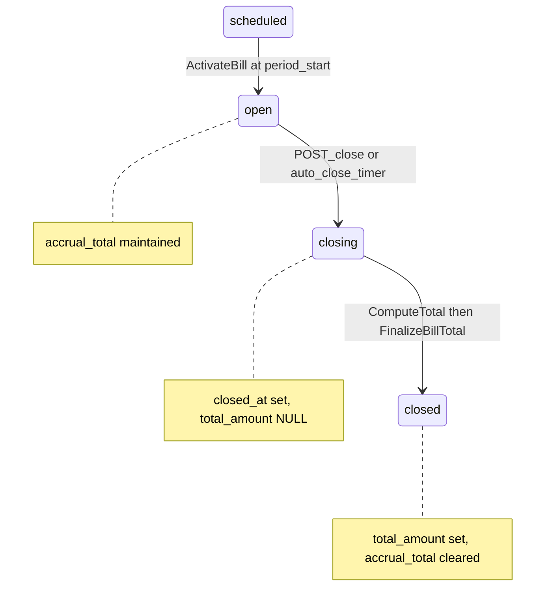

# pave-assignment

Progressive accrual billing API built with [Encore](https://encore.dev) and [Temporal](https://temporal.io).

Postgres is the **read model** for HTTP. Temporal workflows (`bill-{id}`) orchestrate lifecycle transitions, persist fees, and compute close totals.

---

## Data models

### Entity relationship

```
customers (logical, not a table)
    │
    └── bills (1 per customer / period / currency)
            │
            └── line_items (many; idempotent on external_reference_id)
```

### `bills`

Invoice header. One row per `(customer_id, period_start, period_end, currency)`.

| Column | Type | Description |
|--------|------|-------------|
| `id` | UUID | Primary key |
| `customer_id` | TEXT | Customer identifier |
| `period_start` | DATE | Billing period start (inclusive) |
| `period_end` | DATE | Billing period end (inclusive) |
| `currency` | CHAR(3) | Invoice / settlement currency (ISO 4217) |
| `status` | `bill_status` | `scheduled` \| `open` \| `closing` \| `closed` |
| `accrual_total` | NUMERIC(19,9) | Running total in bill currency while `open`; NULL otherwise |
| `total_amount` | NUMERIC(19,9) | Final invoice total when `closed`; NULL while open/closing |
| `created_at` | TIMESTAMPTZ | Row creation time |
| `closed_at` | TIMESTAMPTZ | Set when entering `closing` |
| `workflow_run_id` | TEXT | Temporal workflow run ID |

**Constraints:** `UNIQUE (customer_id, period_start, period_end, currency)`; `period_end > period_start`; `currency` matches `^[A-Z]{3}$`.

**Initial status on create:**

- `scheduled` if `period_start` is after today (UTC date)
- `open` if `period_start` is today or in the past

**Go type:** `domain.Bill` (`domain/bill.go`)

### `line_items`

Individual fees on a bill. Stored in original amount and currency; converted to bill currency at close.

| Column | Type | Description |
|--------|------|-------------|
| `id` | UUID | Primary key |
| `bill_id` | UUID | FK → `bills.id` |
| `fee_type` | `fee_type` | `subscription` \| `usage` \| `tax` \| `penalty` \| `discount` |
| `description` | TEXT | Human-readable label |
| `quantity` | NUMERIC(19,9) | Must be > 0 |
| `unit_price` | NUMERIC(19,9) | May be negative (discounts) |
| `total_amount` | NUMERIC(19,9) | `quantity × unit_price` |
| `currency` | CHAR(3) | Line denomination; defaults to bill currency if omitted on API |
| `effective_date` | DATE | Must fall within bill period |
| `external_reference_id` | TEXT | Idempotency key per bill |
| `created_at` | TIMESTAMPTZ | Row creation time |

**Constraints:** `UNIQUE (bill_id, external_reference_id)` — duplicate POST returns existing row. DB trigger rejects inserts when parent bill `status <> 'open'`.

**Go type:** `domain.LineItem` (`domain/line_item.go`)

### Multi-currency

| Concept | Rule |
|---------|------|
| Bill `currency` | Invoice currency; `total_amount` and `accrual_total` are always in this currency |
| Line item `currency` | Optional; may differ from bill (e.g. GEL line on USD bill) |
| Conversion | Static rates in `money/rates.go` at close / accrual time |
| Supported pairs | USD ↔ GEL (extensible) |

Example: USD bill with `99 USD` + `100 GEL` at `1 GEL = 0.37 USD` → close total **`136.00 USD`**.

Line items in API responses keep their **original** `currency` and `total_amount`. Amounts use `github.com/govalues/decimal` and `NUMERIC(19,9)` in Postgres.

---

## API endpoints

Base URL (local): `http://localhost:4000`

| Method | Path | Purpose | Response |
|--------|------|---------|----------|
| `POST` | `/bills` | Create bill + start workflow | **200** `Bill` |
| `GET` | `/bills/:id` | Read bill (includes line items) | **200** `Bill` |
| `POST` | `/bills/:id/line-items` | Add fee to open bill | **200** `LineItem` |
| `POST` | `/bills/:id/close` | Start close (async) | **202** `{ bill_id, status: "closing" }` |
| `POST` | `/bills/:id/close?wait=true` | Close and wait | **200** `CloseBillResponse` |
| `POST` | `/bills/:id/finalize` | Recover stuck close | **200** `CloseBillResponse` |

### Request / response types

**CreateBillRequest:** `customer_id`, `period_start`, `period_end`, `currency`

**AddLineItemRequest:** `fee_type`, `description`, `quantity`, `unit_price`, `effective_date`, `external_reference_id`, optional `currency`

**CloseBillResponse:** `total_amount` (bill currency), all `line_items`, `closed_at`, period dates

**CloseBillAccepted (202):** `bill_id`, `status: "closing"` — poll `GET /bills/:id` until `status` is `closed`

On duplicate bill create, **409** returns existing bill id in `details.bill_id`.

### HTTP status codes

| Code | When |
|------|------|
| 404 | Bill not found |
| 400 | Validation (fee type, period, unsupported currency pair, invalid UUID) |
| 409 | Duplicate bill or duplicate line item (existing resource returned) |
| 422 | Line item on non-open bill; close on already-closed bill; bill not yet open (`scheduled`) |
| 202 | Close accepted — poll GET until `closed` |

### Quick start (curl)

Use a current billing period so the bill stays `open` (past `period_end` triggers auto-close):

```bash
BILL_ID=$(curl -s -X POST http://localhost:4000/bills \
  -H 'Content-Type: application/json' \
  -d '{"customer_id":"cust_001","period_start":"2026-06-01","period_end":"2026-06-30","currency":"USD"}' \
  | jq -r '.id // .details.bill_id // .details.bill.id')

curl -X POST "http://localhost:4000/bills/$BILL_ID/line-items" \
  -H 'Content-Type: application/json' \
  -d '{"fee_type":"subscription","description":"Monthly plan","quantity":"1","unit_price":"99.00","effective_date":"2026-06-01","external_reference_id":"sub-jun-2026"}'

curl -X POST "http://localhost:4000/bills/$BILL_ID/close?wait=true" | jq
curl "http://localhost:4000/bills/$BILL_ID" | jq
```

---

## Bill lifecycle

Two parallel status systems exist. They align during normal operation but are not identical.

| DB `bills.status` | Workflow `phase` (Temporal `status` query) | Line items allowed? |
|-------------------|--------------------------------------------|---------------------|
| `scheduled` | `waiting_period_start` | No |
| `open` | `accruing` | Yes |
| `closing` | `closing` | No |
| `closed` | *(workflow completed — query unavailable)* | No |



**Rules**

- Line items accepted only while status is **`open`**.
- **`accrual_total`** is maintained while `open` and cleared when the bill becomes `closed`.
- **`closing`** freezes the bill; the workflow runs `EnsureBillClosing` → `ComputeTotal` → `FinalizeBillTotal`.
- When finalization completes, the workflow is **Completed** — use `GET /bills/:id` instead of Temporal queries.
- **Auto-close** fires at **00:00 UTC on the day after `period_end`**.

**Temporal queries** (while workflow is running):

```bash
temporal workflow query --workflow-id bill-{id} --name status
temporal workflow query --workflow-id bill-{id} --name accrual
```

`status` returns phase, `accrual_total`, line item count, and period dates.  
`accrual` returns the full in-memory accrual state including line item payloads.

---

## Architecture

### Overview

- **Postgres** (Encore `sqldb`) is the source of truth for reads.
- **Temporal** runs one long-lived workflow per bill (`bill-{uuid}`) on task queue `{env}-billing`.
- **Worker** runs inside `encore run` alongside the API.

### Request flows

**Create bill**

```
POST /bills → DB insert → ExecuteWorkflow(BillWorkflow) → return Bill
```

**Add line item**

```
POST /line-items → validate → signal workflow → PersistLineItem activity → poll DB → return LineItem
```

**Close bill**

```
POST /close → MarkBillClosing (open→closing) → signal workflow → close segment
           → EnsureBillClosing → ComputeTotal → FinalizeBillTotal → closed
```

Default close returns **202** immediately; `?wait=true` blocks until the workflow completes.

### Temporal mapping

| Property | Value |
|----------|-------|
| Workflow ID | `bill-{bill_uuid}` |
| Task queue | `{env}-billing` |
| Input | `BillID`, `CustomerID`, `Currency`, `PeriodStart`, `PeriodEnd` |

| Signal | When sent | Effect |
|--------|-----------|--------|
| `bill.line_item.added` | After `POST /line-items` validates | `PersistLineItem` + update `accrual_total` |
| `bill.close` | After `POST /close` marks bill `closing` | Exit accrual loop; run close segment |

| Activity | Purpose |
|----------|---------|
| `ActivateBill` | `scheduled` → `open` at period start |
| `PersistLineItem` | Insert line item (idempotent); workflow-led accrual |
| `UpdateAccrualTotal` | Write running total to `bills.accrual_total` |
| `EnsureBillClosing` | `open` → `closing` (idempotent) |
| `ComputeTotal` | Sum line items in bill currency (FX) |
| `FinalizeBillTotal` | `closing` → `closed`; set `total_amount`, clear `accrual_total` |

### Project layout

```
billing/     Encore service (API, DB, Temporal worker)
workflow/    BillWorkflow definition
activity/    Temporal activities
domain/      Pure types and errors
money/       decimal adapter, FX conversion
scripts/     verify and load test scripts
```

---

## Prerequisites

```bash
brew install encoredev/tap/encore temporal jq
```

Docker Desktop must be running (Encore provisions local Postgres).

## Run locally

Terminal 1 — Temporal:

```bash
temporal server start-dev --namespace default --port 7233
```

Web UI: http://localhost:8233

Terminal 2 — Encore:

```bash
encore run
```

API base URL: http://localhost:4000

## Verify end-to-end

```bash
chmod +x scripts/verify.sh scripts/verify-*.sh
./scripts/verify.sh
```

Individual scripts:

```bash
./scripts/verify-discount.sh        # subscription + usage + discounts
./scripts/verify-multi-currency.sh    # USD bill + GEL line items
./scripts/verify-accrual.sh           # accrual_total vs Temporal query
./scripts/verify-lifecycle.sh         # scheduled → open activation
./scripts/verify-close-async.sh     # async close (202) then poll
```

Check workflow `bill-$BILL_ID` is **Completed** in the Temporal UI after close.

## Worker restart resilience

1. Create a bill and add line items (do not close).
2. Stop `encore run` (Ctrl+C).
3. Restart `encore run` — the worker re-attaches to the same task queue.
4. `POST /bills/:id/close` should still succeed; Temporal replays workflow history.

## Tests

```bash
ENCORERUNTIME_NOPANIC=1 go test ./...
encore test ./...
```

### Load / race-condition tests

Requires Temporal and Encore running:

```bash
chmod +x scripts/load/*.sh
./scripts/load/run-all.sh
```

| Script | What it tests |
|--------|---------------|
| `race-duplicate-bill.sh` | N concurrent `POST /bills` with same body → 1 bill |
| `race-concurrent-line-items.sh` | N unique `external_reference_id`s → N rows, correct sum |
| `race-duplicate-line-item.sh` | N identical line-item POSTs → 1 row, same `id` |
| `race-add-after-close.sh` | N adds after close → all 422, count unchanged |
| `race-duplicate-close.sh` | N concurrent closes → correct total |
| `race-close-vs-add.sh` | Close while adds in flight → closed total = DB sum |

Run a single scenario: `./scripts/load/race-duplicate-line-item.sh`

Go integration tests (barrier-synchronized):

```bash
go test -tags=integration ./tests/integration/ -run TestRace -v -count=1
```

Audit after any scenario:

```bash
./scripts/load/audit.sh <bill_id> [expected_count] [expected_total]
```

**Environment variables**

| Variable | Default | Description |
|----------|---------|-------------|
| `BASE_URL` | `http://localhost:4000` | API base URL |
| `CONCURRENCY` | varies per script | Parallel workers |
| `SKIP_SLOW=1` | — | Skip `race-close-vs-add.sh` in `run-all.sh` |
| `SKIP_WORKFLOW_CLEANUP=1` | — | Leave workflows running (not recommended) |

Scripts auto-close open bills on exit unless `SKIP_WORKFLOW_CLEANUP=1`. Manual cleanup: `./scripts/load/cleanup-workflows.sh <bill-uuid>`

**Interpreting failures**

- **Duplicate bill: multiple UUIDs** — unique constraint or 409 handling broken
- **Duplicate ref: count > 1** — idempotency race
- **Add after close: 2xx** — closed-bill guard or DB trigger missing
- **Close total ≠ sum** — close-time consistency bug
- **D1: ok_adds ≠ db_count** — line item inserted but not counted, or ghost rejection
